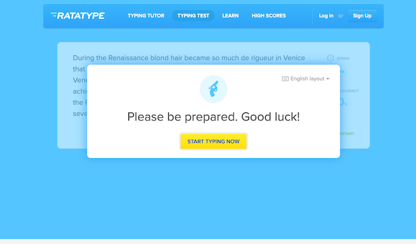
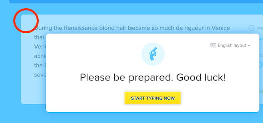
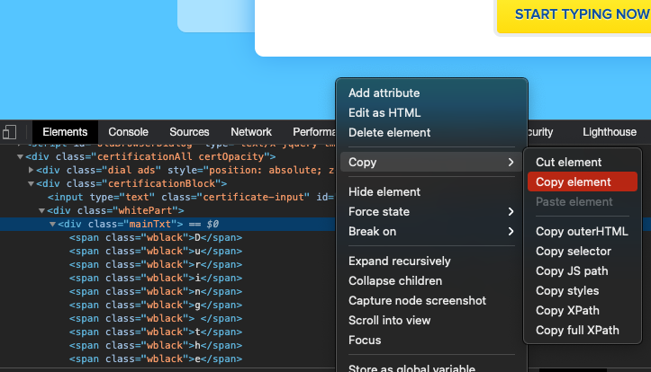
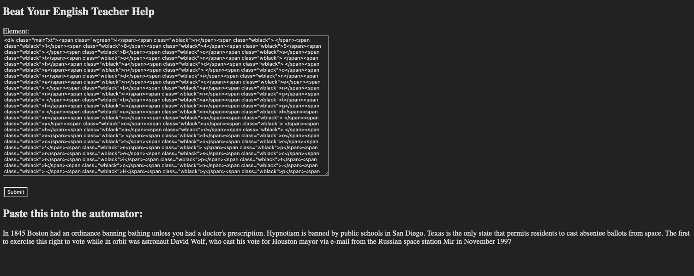
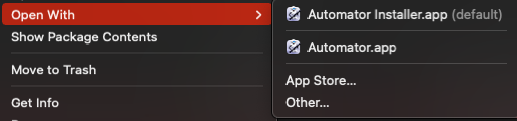
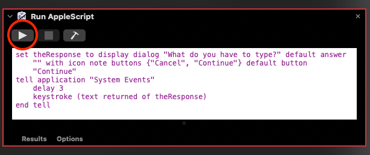
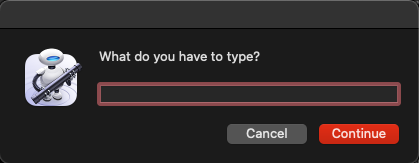
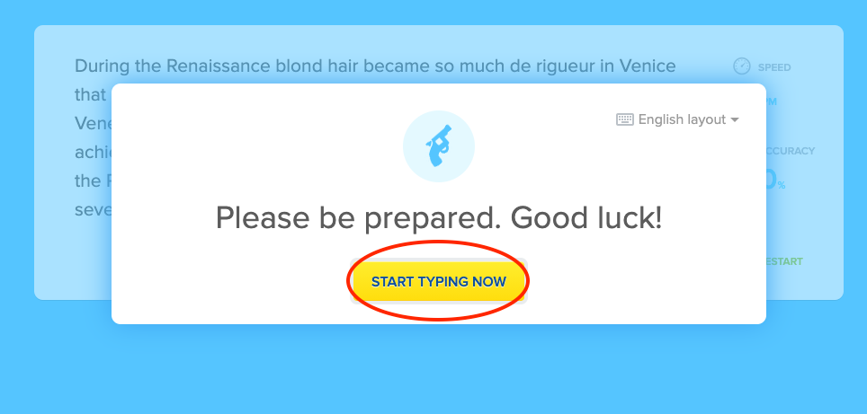
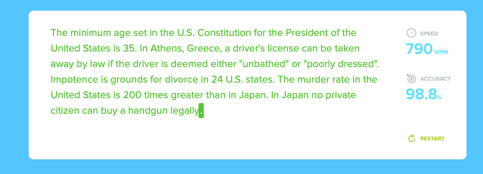
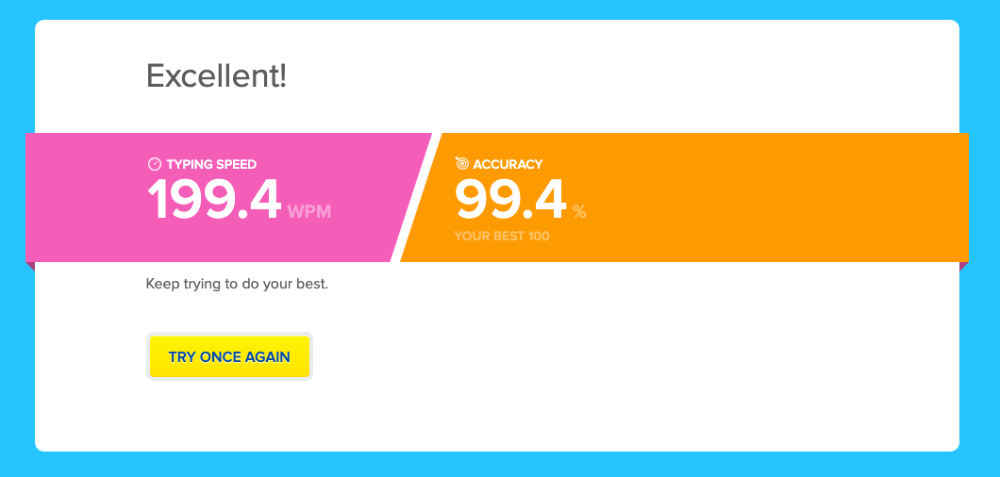

# Beat Your English Teacher 
## How to beat Ratatype

This repository is a tutorial on how to beat [Ratatype](https://www.ratatype.com/typing-test/).
It is necessary that you are on macOS as this uses AppleScript.

## Tutorial

*This tutorial assumes you are on a Chrome or Brave, or anything similar.

Go to [https://www.ratatype.com/typing-test/](https://www.ratatype.com/typing-test/).

Click on "TAKE A TYPING TEST".

Do not click on "START TYPING NOW", yet.

Now, on your keyboard, press ⌘ + Shift + C. Then, click on the white area on your screen (shown in a red circle in the image below).

Then, in the html code shown on your browser, look for the element within the white part you just selected (with class="whitePart") that has class="mainTxt". Then, right click on it and copy the element.

Then, visit [https://yumi.to/byet-help.php](https://yumi.to/byet-help.php) and paste the element copied, and submit. Then, copy the output.

Then, download [typing.workflow.zip](typing.workflow.zip). Unzip it if necessary. Then, insted of opening the file normally, right click then select to Automator (*not Automator Installer).

Then, click on the run button (shown in red circle in the image below) to run the AppleScript.

Then, you will be promped the following, "What do you have to type?".

Paste the copied sentence(s) from [https://yumi.to/byet-help.php](https://yumi.to/byet-help.php). Then, within 3 seconds, go back to your browser and click on "START TYPING NOW".

Then, wait a few seconds until there is only the last period left to be typed. Here, you have to control your typing speed by looking at the right and type the last period whenever you feel. (*this website only allows up to 200 wpm, so type the last period when the speed is less than 200 wpm)

Now, you've beaten both the game and your English teacher!

Have a great day!